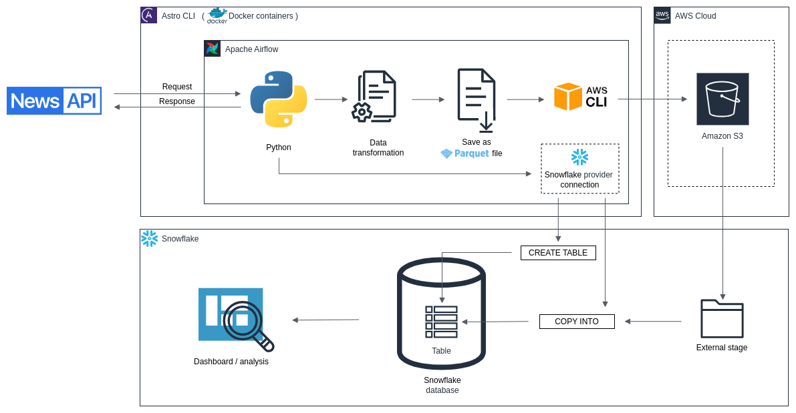
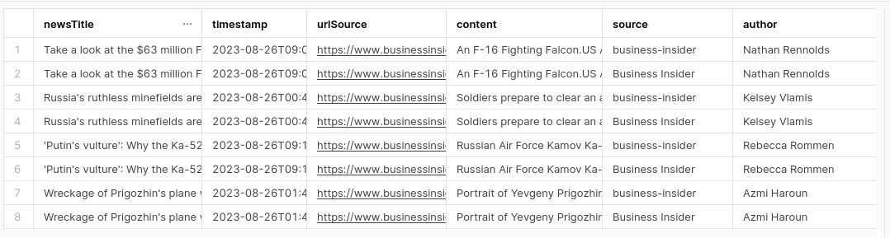

# newsapi_fetcher_etl


[Click here to open the image in a new tab](readme-images/diagram_drawio.png)

Welcome to the **newsapi_fetcher_etl** project! This guide will help you get up and running with the project quickly.

## Prerequisites
Before you begin, ensure you have the following:

+ Python (version 3.6 or higher) installed on your system.
+ **Astro CLI** installed on your system.
+ An API key from **NewsAPI** to access their news data.

## Installation

### Installing Astro CLI 

To install the **Astro CLI**, please follow these steps:

1. Visit the official [Astro CLI repository](https://github.com/astronomer/astro-cli)

2. Follow the installation instructions provided in the repository's README.md file. You will find detailed steps on how to install the Astro CLI tool on your system.

3. Depending on your operating system and preferences, you can choose between various installation methods, such as using a package manager or installing from source.

4. Verify Installation: To verify that the Astro CLI has been successfully installed, you can run the following command:

```
astro --version
```

&emsp; &emsp; &nbsp; This should display the version of the Astro CLI installed on your system.

## Usage

Now that you have the Astro CLI installed, you can easily use this project. Here's how:

1. **Clone or Download this Project:** Clone or download this project repository to your local machine.

```bash
git clone https://github.com/...
```

2. **Navigate to the Project Directory:** Change your working directory to the root of the cloned project.

```bash
cd path/to/project
```

3. **Locate fetcher file:** Open the `news_fetcher_etl.py` file in a text editor of your choice.

4. **Place your API key for NewsAPI:** Locate the section of the code where the API key needs to be added.

```python
api_key = 'YOUR_API_KEY_HERE'
```
&emsp; &emsp; &nbsp; Replace 'YOUR_API_KEY_HERE' with your actual NewsAPI key.

5. **Change searching title:** Identify the line of code where the search title is specified:
   
```python
api_url = base_url.format('SEARCH_TITLE_HERE', start_date_value, end_date_value, api_key)
```
&emsp; &emsp; &nbsp; Replace 'SEARCH_TITLE_HERE' with the desired title for searching news articles.

6. **Change S3 bucket URL:** Open the `airflow_news_data_pipeline.py` file and identify the line of code where URL to your S3 bucket is specified. Change it to yours:

```python
task_id="move_file_to_s3",
bash_command='aws s3 mv {{ ti.xcom_pull("extract_news")}}  s3:// ',
```

7. **Create database, table, stage and file format:** Inside your Snowflake warehouse create proper database, table, file format for parquet files and stage to your S3 bucket. Place corresponding values inside `airflow_news_data_pipeline.py` file.

8. **Place your AWS role credentials:** Locate the Docker file and your AWS role credentials in each field.
```
ENV AWS_ACCESS_KEY_ID=
ENV AWS_SECRET_ACCESS_KEY=
ENV AWS_DEFAULT_REGION=
```

9. **Initialize and Deploy:** Use the Astro CLI to initialize the project and deploy it using the following commands:

```python
astro dev newsapi_fetcher_etl
```

&emsp; &emsp; &nbsp; This command will start the development server and make your project accessible in your browser.

10. **Access the Airflow UI:** Visit localhost:8080 in your browser and log in with the admin account details shown in the terminal.

11. **Connect to Snowflake:** Go under Admin->Connections. Click on + symbol and add a new record Choose the connection type as Snowflake and fill other details.

#

That's it! You're now ready to start working with the **newsapi_fetcher_etl** using the **Astro CLI**. If you encounter any issues or need further assistance, feel free to refer to the Astro CLI documentation or reach out to the project community for support.

Output data inside Snowflake warehouse table will look something like this (**SEARCH_TITLE_HERE** was set to word "war"):


[Click here to open the image in a new tab](readme-images/snowflake_data_example.png)

